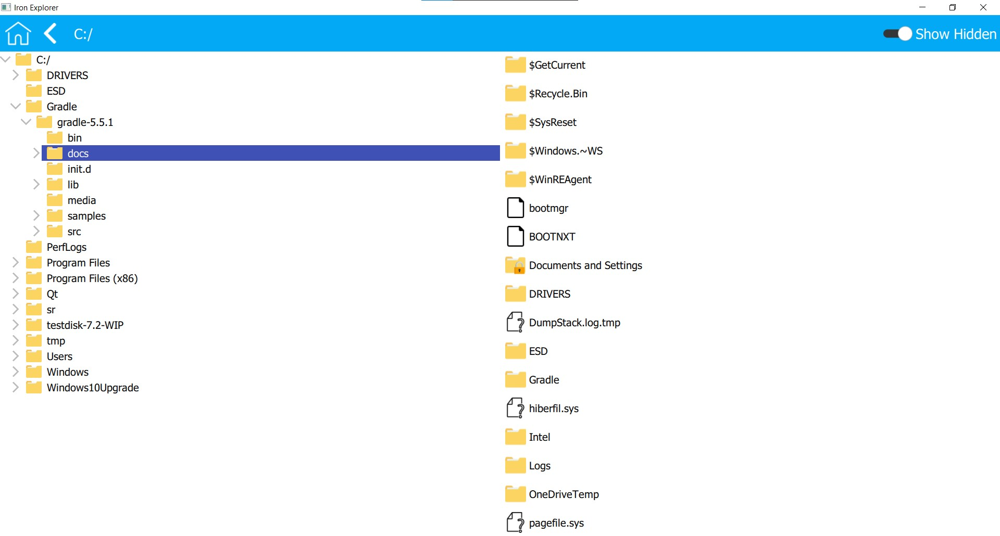

# Explorer

## Cross-platform File Browser

## C++, Qt Quick

### Architecture
Project is divided into several submodules: `client`, `server`, `common`

`Client` is Qt Quick GUI

`Server` provides REST API

Communication is done via HTTP protocol using TCP sockets

`Common` files contain HTTP Message classes and utilities to parse them into and from strings

### How to build and how to run
Probably the simplest way to launch the application is to do it from `Qt Creator`.
However, if this is not an option for you, next I will show how to do it with `command line` and `cmake`

**Before we start, please add `Qt bin` location (e.g. `C:\Qt\5.15.1\mingw81_64\bin`) to your `path` environment variable.**
Otherwise, you will have to manually copy dlls to your build directory,
define environment variables in your run configuration (e.g. `QT_QPA_PLATFORM_PLUGIN_PATH`) and configure other nasty stuff

```
- cd <project root>
- mkdir build
- cd build
- cmake -G <Generator> ..
- make
- Explorer
```
`cmake -G` - To list all generators

If `make` doesn't work for you, try `cmake --build build --target Explorer` from project root

Build `client` and `server` using the above commands and launch them both in any order


